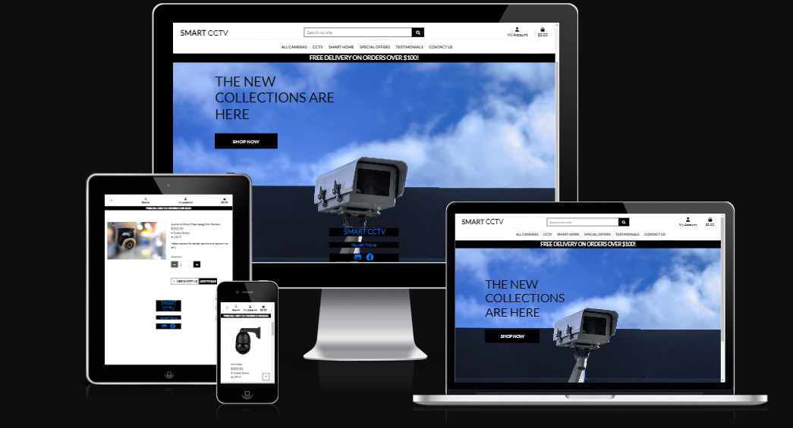

<h1 align="center">SMART CCTV</h1>

View GitHub repository
<a href="https://github.com/Zaurtime/smart_cctv" target="_blank" rel="noopener">here</a>

The live site can viewed here
<a href="https://smartcctv.herokuapp.com/" target="_blank" rel="noopener">here</a>

# SMART CCTV - README INTRODUCTION
 
## PURPOSE OF THIS SITE:
Smart CCTV is an online e-commerce cameras store. The site specifically sells cameras, recently released in various different categories.

### Smart CCTV - A Comprehensive Business Model and Marketing Strategy for a B2C Camera CCTV E-commerce Store

Introduction:
Smart CCTV is an online B2C e-commerce store specializing in selling high-quality CCTV cameras and surveillance equipment to residential and small business customers. The primary intent of Smart CCTV is to provide customers with top-notch security solutions, offering a wide range of cameras and accessories to safeguard their properties and loved ones. The following outlines the core business intents and marketing strategies for the application.

Core Business Intents:

a. Product Quality and Diversity:
Smart CCTV aims to offer a diverse selection of cutting-edge CCTV cameras and accessories from reputable brands. The store will focus on delivering superior products with high-resolution video capabilities, night vision, motion detection, and mobile app integration for remote monitoring. Quality assurance and customer satisfaction will be top priorities to build trust and retain loyal customers.

b. Exceptional Customer Service:
To enhance the overall customer experience, Smart CCTV will provide responsive customer support via multiple channels (phone, email, chat). Knowledgeable representatives will be available to guide customers in choosing the right products based on their specific needs and budget. Post-purchase support will also be emphasized to ensure seamless product installation and usage.

c. User-Friendly Online Platform:
The e-commerce store will feature an intuitive and user-friendly interface, enabling customers to easily browse through product categories, read specifications, read reviews, subscribe to newsletters and make secure transactions. Emphasis will be on optimizing the website for various devices (desktop, mobile, tablet) to accommodate customer preferences.

d. Educative Content Creation:
Smart CCTV will focus on becoming an authority in the security surveillance domain. This will be achieved through a regularly updated newsletter section offering educational content, guides, and articles on home security best practices, DIY installation tips, and technology advancements. The goal is to position the brand as a valuable resource for customers seeking information and to drive organic traffic through SEO efforts.

#### Marketing Strategies:
a. Search Engine Optimization (SEO):
Smart CCTV will invest in keyword research to optimize product pages and blog content for search engines. By targeting relevant keywords related to home security and surveillance, the store aims to improve organic rankings and attract potential customers actively searching for such products.

b. Pay-Per-Click (PPC) Advertising:
To drive immediate traffic and sales, Smart CCTV will utilize PPC campaigns on platforms like Google Ads and Bing Ads. Advertisements will be highly targeted, focusing on specific camera models, key features, and related keywords, with a keen eye on maintaining a competitive budget.

c. Social Media Marketing:
A strong social media presence will be established on platforms such as Facebook, Instagram, and Twitter. Engaging content, including product showcases, customer testimonials, and informative posts, will be shared to generate brand awareness, engage with the audience, and foster a sense of community.

d. Email Marketing:
Smart CCTV will implement email marketing campaigns to nurture leads, re-engage previous customers, and promote special offers or discounts. Personalized emails will be sent based on customer preferences and purchase history to increase customer retention and foster loyalty.

e. Influencer Collaborations:
Partnering with influencers in the security and tech niche, Smart CCTV will leverage their reach to showcase products and share positive experiences with their followers. Influencer collaborations will amplify brand exposure and credibility.

f. Referral Program:
To incentivize word-of-mouth marketing, Smart CCTV will introduce a referral program where customers can earn rewards or discounts by referring friends and family. This strategy aims to tap into existing customer networks and expand the customer base.

g. Seasonal and Festive Campaigns:
Throughout the year, Smart CCTV will run targeted campaigns during festive seasons and events, offering exclusive deals and discounts to encourage purchases during peak shopping periods.

By integrating these core business intents and marketing strategies, Smart CCTV endeavours to become a reputable and go-to destination for customers seeking top-quality CCTV cameras and related security solutions. Through constant innovation, customer-centricity, and a focus on delivering value, Smart CCTV aims to thrive in the competitive B2C CCTV e-commerce market.

#### Financial plan for an e-commerce store with a budget of $300,000 

Website Development and Design: $50,000
- E-commerce platform subscription and setup: $10,000
- Custom website development and design: $40,000

Inventory Procurement: $150,000
- Purchase of CCTV cameras and related products: $130,000
- Shipping and handling fees: $20,000
  
Marketing and Advertising: $70,000
- Pay-Per-Click (PPC) advertising budget: $20,000
- Social media marketing and influencer collaborations: $20,000
- Email marketing and content creation: $10,000
- Seasonal and festive campaign promotions: $10,000
- Search Engine Optimization (SEO) and Search Engine Marketing (SEM): $10,000

Operating Expenses: $15,000
- Web hosting and domain registration: $1,000
- Office supplies and equipment: $3,000
- Legal and regulatory fees: $1,000
- Employee salaries: $10,000
  
Contingency Fund: $15,000
- Reserve for unexpected expenses or emergencies.

Total Budget: $300,000

#### Financial Projections

Revenue Projections: Based on market research and competitor analysis, estimate the expected monthly sales volume. Aim for steady growth over the first year and beyond.

Pricing Strategy: Smart CCTV team will set competitive prices that balance attracting customers and maintaining profitability.
With a more substantial budget, the e-commerce store can invest in high-quality website development, a wide range of inventory, and targeted marketing efforts to establish a strong brand presence and attract a large customer base.

## IMPORTANT INSTRUCTIONS:
If you wish to register or receive a confirmation email, you need to enter a real email address or generate a test email through an email generator site when registering or purchasing items.
 
 

**Stripe test cards for checkout** 

- The card payment succeeds and doesn’t require authentication.
  * Fill out the credit card form using the credit card number 4242 4242 4242 4242 with any expiration, CVC, and postal code.
- The card payment requires authentication.	
  * Fill out the credit card form using the credit card number 4000 0025 0000 3155 with any expiration, CVC, and postal code.
  
  You can read more about <a href="https://stripe.com/docs/payments/accept-a-payment?platform=web&ui=elements#web-test-the-integration" target="_blank" rel="noopener">here</a>
  
 ## SUPERUSER SITE ADMIN FUNCTION:
This site uses Django's Admin functionality for content moderation control. The site has a Superuser with their own login credentials.
 
The Admin panel can be accessed simply from the home page. You can navigate to it by clicking in the URL bar, hit / (forward slash) on keyboard and type admin. Like so: **/admin** and hit **enter**

**NOTE:**
- During the development of this project, I posted test testimonials posts and added user records. This was done to test the functionality of the **Add testimonials**, **Edit testimonials** and **Delete testimonials** functions. And to test that testimonials were successfully added, edited and deleted.
- You will also find some comments visible in the testimonials detail, this was also done to test functionality.
- **(All of the testimonials content is simply just placeholder text used to test the functionality of content display for site)**
- The User after the purchase can leave a review.
- Site Admin can do all of the above from the admin panel.
 
 

# SEO (Search Engine Optimisation) and Marketing
## SEO
Keywords and phrases entered as metadata in the head of the HTML document and throughout the main content of the site help search engines find relevant, searchable content.

In order to improve the site search engine ranking two important files were added to the project :

A sitemap.xml file This file was added to help speed up content discovery for search engines when they crawl and index web applications. A robots.txt file This file was added to acknowledge that search engines are allowed on the site and that they may have free access to it. A robots.txt file is a simple text file that tells search engines where they are not allowed to go on a website. It lists out any folders or files that will not be crawled or indexed by search engine spiders.

## Marketing
#### In the footer of Contact page, site visitors can find a link to sign up to the Smart CCTV newsletter.

Site Users can submit their email addresses on the form provided on the newsletter page.

#### Social Media

Here is the link  [Facebook B2C](https://www.facebook.com/profile.php?id=100095301210655)

Screenshots of my Facebook Business Page - as shown below 

#### Free Delivery

We will offer free delivery on all orders above a certain threshold to incentivize customers to make a purchase. This will help us increase our average order value and encourage repeat purchases.

## User Goals

- Easily browsing and discovering new camera CCTV products and trends
- Accessing detailed product information and reviews to make informed purchasing decisions
- Access to the latest news and trends of the smart camera industry through the newsletter subscription
- Contact form for information, customer service and support
- Track user orders to have access to order information
- Save favourite products in the bag
- The payment options available, including any security measures in place to protect customer information.

## Site Owner Goals
- To create a visually appealing and user-friendly website that engages and converts visitors into loyal customers
- To offer a wide range of high-quality Smart Camera products that cater to diverse needs, and budgets, ensuring customer satisfaction and loyalty
- To offer secure and seamless payment options that build trust and confidence among customers, reducing cart abandonment rates and increasing sales
- Generate revenue through the sale of products in the e-commerce shop

## User Experience
### Target Audience
- Homeowners enthusiasts of all ages who are passionate about security, safety, and other smart products and are always looking for the latest trends and innovations in the industry.
- Pet Owners: Pet owners who want to keep an eye on their pets when they are not at home.
- Car Owners: Vehicle owners interested in dashcams or CCTV systems for monitoring car surroundings and security.
- Individuals with Special Needs: People with specific security requirements, such as elderly individuals living alone or persons with disabilities.
- Educational Institutions: Schools, colleges, and universities looking to ensure campus security and monitor common areas.
- Retail Stores: Businesses in the retail industry seeking CCTV cameras to prevent theft, monitor customer behaviour, and enhance store security.
- Small Business Owners: Entrepreneurs running small businesses, shops, or offices, who require surveillance solutions to safeguard their premises and assets.
- Individuals: looking to enhance the security of their homes and protect their families, belongings, and property.

### User Requirements and Expectations
- Intuitive and easy-to-use website: users expect a website that is easy to navigate and understand, with clear and concise menus, categories, and search options. They want a site that loads quickly and is responsive to their clicks and inputs
- Wide range of products: users want access to a diverse and extensive range of camera products, from popular and well-known brands to niche and emerging ones. They expect products that are up-to-date, high-quality, and competitively priced
- Detailed product information: users expect detailed and accurate product descriptions, images, and customer reviews that help them make informed decisions about what to buy
- Secure and easy payment options: users expect secure and convenient payment option. They want to know that their personal and financial information is safe and protected
- Fast and reliable shipping: users expect fast and reliable shipping and delivery options, with clear and transparent tracking information. They want to know when their orders will arrive and be able to track them throughout the process
- Accessibility

## User Stories
1. As a first time user I can see a website description so that should help me understand what the site is about
2. As a user I can navigate across the site so that can move to each feature of the site easily
3. As a shopper I can use a search on the website so that I can find specific product I would like to purchase
4. As a user I can look at footer so that I can see contact social links and website info
5. As a user I can easily register for an account so that I can have a personal account and be able to view my profile
6. As a user I can login and logout so that I can access my personal account information
7. As an shopper I can receive an email confirmation after registering so that I can verify that my account registration was successful
8. As a user I can have a profile so that I can store my information for faster checkouts
9. As a shopper I can view products so that I can choose something to buy
10. As a shopper  I can sort the list of available products so that I can identify the best rated, best priced and categorically sorted products
11. As a shopper  I can view individual product details so that I can identify the price, description, rating and view reviews
12. As an owner I can add new products to the store so that we can sell more items to our customers
13. As an owner I can remove items from the store so that customers no longer see items I do not intend to sell again
14. As an owner I can edit products so that products have the correct information and/or pricing
15. As a shopper  I can add products to bag so that I can review my items before I buy them
16. As a shopper I can remove items from my cart so that I can start my shopping again or decide against placing an order
17. As a shopper I can add testimonials about products so that can others see and buy interesting products
18. As a shopper I can be interested in previous shopper experience so that I can choose a product according to the best reviews
19. As a shopper I can leave my own review on each product so that I can rate the product and write about its advantages or disadvantages
20. As a shopper I can easily enter my payment information so that I can check out quickly and with no hassles
21. As a shopper I can pay for product so that I can complete the payment through secure checkout
22. As a shopper I can see my orders so that I can track the progress of all my orders
23. As a shopper I can look at blog so that it provides me regular updates through published posts
24. As a shopper I can contact the business so that I can communicate with a person
25. As a user I can find the store's social networks so that see all the information and updates
26. As a shopper I can sign up for a newsletter so that I can get access to special offers or promotions
27. As a shopper I can quickly identify deals clearance items and special offers so that I can take advantage of special saving on products I'd like to purchase
28. As a shopper I can easily view the total of my purchases at any time so that avoid spending too much
29. As a user I can see my order history so that I always know what product I bought and have access to order the product again if I liked it
30. As a user I can receive am email from shop where I ordered items so that I always confirm my purchase and know what I ordered

### User Stories
- GitHub projects were used to track all open user stories

## Wireframes

Balsamiq was used to create wireframes for this project.

## Design

### Colors

The SMART CCTV website has a colour scheme that is primarily classic white, black and blue. The website such as white and black to create a cohesive and visually appealing colour palette that reflects the brand's identity and values. The blue creates a sense of freedom.

 

### Fonts

The font was selected from Google Fonts, Lato. It is a popular choice for headings, titles, and other display purposes, as it has a classic and elegant look that is well-suited to a range of design styles. The font's unique combination of thick and thin strokes, along with its generous spacing and high contrast, give it a distinct and sophisticated appearance.

## Structure

The site was designed for the user to be familiar with the layout such as a navigation bar along the top of the pages and a hamburger menu button for smaller screens.
The pages are structured in a user-friendly and easy-to-learn way. Upon arriving at the website the user sees the home page, with a call to action.

## Website pages
The site consists of the following pages:

- Home page
- Products page
- Product details page
- Post details page
- Contact page
- Register page
- Login page
- Logout page
- Profile page
- Testimonials page
- Bag page
- Checkout page
- Checkout success page

## Models  

User Model

| Key        | Name         | Type        |
| ---------- | ------------ | ----------- |
| PrimaryKey | user_id      | AutoField   |
|            | password     | VARCHAR(45) |
|            | last_login   | VARCHAR(45) |
|            | is_superuser | BOOLEAN     |
|            | username     | VARCHAR(45) |
|            | first_name   | VARCHAR(45) |
|            | last_name    | VARCHAR(45) |
|            | email        | VARCHAR(45) |
|            | is_staff     | BOOLEAN     |
|            | is_active    | BOOLEAN     |
|            | date_joined  | VARCHAR(45) |

User Profile Model

| Key        | Name                 | Type          |
| ---------- | -------------------- | ------------- |
| PrimaryKey | user_profile_id      | AutoField     |
| ForeignKey | user                 | User model    |
|            | default_phone_number | CharField[20] |
|            | default_street_address1| CharField[80] |
|            | default_street_address2 | CharField[80] |
|            | default_town_or_city | CharField[40] |
|            | default_county       | CharField[80] |
|            | default_postcode     | CharField[20] |
|            | default_country      | CountryField |

Products Model

| Key        | Name        | Type           |
| ---------- | ----------- | -------------- |
| PrimaryKey | product_id  | AutoField      |
| ForeignKey | category    | Category model |
|            | sku         | CharField[254] |
|            | name        | CharField[254] |
|            | description | TextField      |
|            | has_sizes   | BooleanField   |
|            | price       | DecimalField   |
|            | rating      | DecimalField   |
|            | image_url   | URLField       |
|            | image       | ImageField     |

Category Model

| Key        | Name        | Type             |
| ---------- | ----------- | --------------   |
| PrimaryKey | id          | AutoField        |
|            | name        | CharField[150]   |
|            | friendly_name | CharField[254] |

Product Review Model

| Key        | Name        | Type           |
| ---------- | ----------- | -------------- |
| PrimaryKey | review_id   | AutoField      |
| ForeignKey | product     | Product model  |
| ForeignKey | user        | User model  |
|            | content     | TextField      |
|            | stars       | IntegerField   |
|            | date        | DateTimeField  |

Wishlist Model

| Key        | Name        | Type                |
| ---------- | ----------- | --------------      |
| PrimaryKey | wishlist_id | AutoField           |
| ForeignKey | product     | Product model       |
| ForeignKey | user        | User model          |

Post Model

| Key        | Name           | Type           |
| ---------- | -----------    | -------------- |
| PrimaryKey | post_id        | AutoField      |
|            | title          | CharField[100] |
|            | content        | TextField      |
|            | excerpt        | TextField      |
|            | featured_image | ImageField     |
|            | date_created   | DateTimeField  |

Contact Model

| Key        | Name        | Type             |
| ---------- | ----------- | --------------   |
| PrimaryKey | id          | AutoField        |
|            | name        | CharField[150]   |
|            | email       | EmailField       |
|            | reason      | CharField[15]    |
|            | message     | TextField        |

Order Model

| Key        | Name            | Type               |
| ---------- | --------------- | ------------------ |
| PrimaryKey | order_id        | AutoField          |
|            | order_number    | CharField[32]      |
| ForeignKey | user_profile    | UserProfile Model |
|            | full_name       | CharField[50]      |
|            | email           | EmailField[254]    |
|            | phone_number    | CharField[20]      |
|            | country         | CountryField       |
|            | postcode        | CharField[20]      |
|            | town_or_city    | CharField[40]      |
|            | street_address1 | CharField[80]      |
|            | street_address2 | CharField[80]      |
|            | county          | CharField[80]      |
|            | date            | DateTimeField      |
|            | delivery_cost   | DecimalField[6]    |
|            | order_total     | DecimalField[10]   |
|            | grand_total     | DecimalField[10]   |
|            | original_bag    | TextField          |
|            | stripe_pid      | CharField          |

OrderLineItem Model

| Key        | Name             | Type            |
| ---------- | ---------------- | --------------- |
| PrimaryKey | OrderLineItem_id | AutoField       |
| ForeignKey | order            | Order Model     |
| ForeignKey | product          | Product Model   |
| ForeignKey | product_size     | CharField       |
|            | quantity         | IntegerField    |
|            | lineitem_total  | DecimalField[6] |

# Testing

### CSS Validation

The [W3C Jigsaw CSS Validation Service](https://jigsaw.w3.org/css-validator/) was used to validate the CSS of the website.

base.css

 

checkout.css

profiles.css

### JavaScript Validation

[JSHint](https://jshint.com/) javaScript Validation Service was used to validate all javaScript files.

stripe-elements.js

countryfield.js

## PEP8 Validation

[CI Python Linter](https://pep8ci.herokuapp.com/) was used to check the code for PEP8 requirements

### Bag

  

contexts.py

  
  

  

apps.py

  
  

  

urls.py

  
  

  

views.py

  
  

 

### Checkout

  

admin.py

  
  

  

forms.py

  
  

  

models.py

  
  

  

signals.py

  
  

  

urls.py

  
  

  

views.py

  
  

  

webhook_handler.py

  
  

  

webhooks.py

  
  

 

### Contact 

  

admin.py

  
  

  

forms.py

  
  

  

models.py

  
  

  

urls.py

  
  

  

views.py

  
  

 

### Home

  

urls.py

  
  

  

views.py

  
  

 

### Newsletter
  
  

admin.py

  
  

  

apps.py

  
  

  

models.py

  
  

  

urls.py

  
  

  

views.py

  
  

  

forms.py

  
  

 

### Products

  

admin.py

  
  

  

forms.py

  
  

  

models.py

  
  

  

urls.py

  
  

  

views.py

  
  

 

### Profiles

  

forms.py

  
  

  

models.py

  
  

  

urls.py

  
  

  

views.py

  
  

 

### SmartCCTV
  
  

asgi.py

  
  

  

wsgi.py

  
  

  

settings.py

  
  

  

urls.py

  
  

  

views.py

  
  

 

### Testimonials
  
  

admin.py

  
  

  

apps.py

  
  

  

models.py

  
  

  

urls.py

  
  

  

views.py

  
  

  

forms.py

  
  

 

## Lighthouse Testing
Results of lighthouse testing on the site overall Performance 98 score 

## Features  

### Search Engine Optimisation (SEO)

I used meta keywords that make it possible for people to find my site via search engines. Keywords are ideas and topics that define what my website content is about.
 

### Logo

- A custom logo for the business included only letters.

### Home page

- Home page includes a navbar, a main website slider with images, main text, a button "Shop now" and a footer with website information.

### Navigation
  - Navbar includes links to all products, blog page, contact page, bag, profile page, and wish list
  - Navbar has a search field for products searching
  - Indicates login/logout and register in status.
  - Fully Responsive.
  - On small screens switches to the hamburger menu.
  - Displayed on all pages
 

### Search
- Allows the user to search for products.  

### Footer
- Contains Github and Facebook Business page 
- displayed across all pages.  

### Newsletter Sign Up
- Signup for email mailing list. 

### Social Media Links
- A link is used for the Facebook business page.
- All links open in a new tab to ensure the user is not directed away from the business.
- noopener, noreferrer, nofollow used to communicate with web crawlers and for security and privacy concerns.  

  
### Products  page
  - Products list page contains all products cards, buttons to sort by categories.
  - User allowed to add each product to bag.

### Sorting field
- Allows the user to sort the listed products.  

### Products details
  - Products details page contains product image, description, quantity input, add to bag button.
  - User allowed to add products to bag list or remove accordingly

### Testimonials
- Only registered users can leave, update or delete their reviews on products
  
### Add Product
  - Allows the Admin to add new products.

### Edit Product
  - Allows the Admin to edit the products.

### Delete Product
  - Allows the Admin to delete products

### Bag
  - Contains all products which user selected to buy
  - User can change item quantity
  - User can go to secure checkout page by click on button

### Checkout
  - Allows the user to purchase items in their bag.

### Stripe
  - Allows the user to use stripe for card payments.

### Email Confirmation
  - Allows the user to receive an email confirmation for their order.

### Checkout success
  - Shows the page confirmation with user order.

### Post details page

  - Post details page provides post content.

### Contact page

  - Contact now page contains a message form for the business.
  - Anyone can send a message to the website owner.

### Profile 

  - Allows the user to update their information and see their order history.

### Sign up / Register

- Allow users to register an acoount.

### Sign In

- User can sign in.  

### Sign Out

- Allows the user to securely sign out.
- Ask user if they are sure they want to sign out.  

# Technologies Used

* [GitPod](https://gitpod.io/)
  * The environment used to create the site
* [Github](https://github.com/)
  * Used for version control and repository for the project
* [Django framework](https://www.djangoproject.com/)
  * The framework used to construct the site
* [ElephantSQL](https://api.elephantsql.com/console/cac17a18-94fd-4be5-99fe-f319179d4a64/details)
  * Holds the database for this site
* [Python](https://www.python.org/)
  * Most of the site was constructed using this language
* [HTML](https://html.com/semantic-markup/)
* [Bootstrap](https://getbootstrap.com/)
  * Much of the site uses Bootstrap
* [CSS](https://www.w3.org/Style/CSS/Overview.en.html)
  * Used to style the small portion of the site Bootstrap couldn't handle.
* [JavaScript](https://www.javascript.com/)
  * Used to handle small events such as popups
* [AWS S3](https://aws.amazon.com/free/?all-free-tier.sort-by=item.additionalFields.SortRank&all-free-tier.sort-order=asc&awsf.Free%20Tier%20Categories=categories%23storage&trk=9845b571-f118-41f9-ae80-53f3364524c4&sc_channel=ps&sc_campaign=acquisition&sc_medium=ACQ-P|PS-GO|Brand|Desktop|SU|Storage|S3|GB|EN|Text&s_kwcid=AL!4422!3!489216385180!e!!g!!aws%20s3&ef_id=CjwKCAjwkMeUBhBuEiwA4hpqEJmK52Rp_outs9Ama8hbA1IhA0MOr-OkiPis4BSWVAuobKN7yEmQsRoCSNMQAvD_BwE:G:s&s_kwcid=AL!4422!3!489216385180!e!!g!!aws%20s3&awsf.Free%20Tier%20Types=*all)
  * Used to store site images
* [Stripe](https://stripe.com/gb)
  * Used to handle customer payments
* [Heroku](https://id.heroku.com/login)
  * The hosting site for Tripp's Treasures
* [Dango Crispy Forms](https://django-crispy-forms.readthedocs.io/en/latest/)
  * Used for creating forms on the site.

 

# Deployment

### Heroku Deployment

This application has been deployed from Github using Heroku. Here's how:

1. Create an account at heroku.com
2. Create an app, give it a name and select a region
3. Go to app settings and set DATABASE_URL to config vars
4. Install the plugins dj-database-url and psycopg2-binary in terminal.
5. Run pip3 freeze > requirements.txt so both are added to the requirements.txt file
6. Create a Procfile with the text: web: gunicorn your_app_name.wsgi
7. Ensure debug is set to false in the settings.py file, add localhost, smartcctv.herokuapp.com to the ALLOWED_HOSTS variable in settings.py
8. In the settings.py ensure the connection is to the Heroku postgres database, no indentation if you are not using a separate test database. 
9.  Run "python3 manage.py showmigrations" to check the status of the migrations

10. Run "python3 manage.py migrate" to migrate the database

11. Run "python3 manage.py createsuperuser" to create a super/admin user

12. Run "python3 manage.py loaddata genres.json" on the categories file in products/fixtures to create the genres

13. Run "python3 manage.py loaddata albums.json" on the products file in products/fixtures to create the albums

14. Run "python3 manage.py loaddata tracks.json" on the products file in products/fixtures to create the tracks

15. Install gunicorn (pip install gunicorn) and add it to the requirements.txt file using the command pip3 freeze > requirements.txt

16. Disable collectstatic in Heroku before any code is pushed using the heroku settings config vars: set DISABLE_COLLECTSTATIC: 1

* Add the following config vars :
  - AWS_ACCESS_KEY_ID
  - AWS_SECRET_ACCESS_KEY
  - DATABASE_URL
  - EMAIL_HOST_USER
  - SECRET_KEY
  - SECRET_WH_SECRET
  - STRIPE_PUBLIC_KEY
  - STRIPE_SECRET_KEY
  - USE_AWS

17.  Ensure the following environment variables are set in Heroku

19.  Connect the app to GitHub, and enable automatic deploys from the main if you wish

20.  Click deploy to deploy your application to Heroku for the first time

21.  Click on the link provided to access the application

22.  If you encounter any issues accessing the build logs is a good way to troubleshoot the issue

### Fork Repository
To fork the repository by following these steps:
1. Go to the GitHub repository
2. Click on Fork button in the upper right-hand corner

### Clone Repository
You can clone the repository by following these steps:
1. Go to the GitHub repository 
2. Locate the Code button above the list of files and click it 
3. Select if you prefer to clone using HTTPS, SSH, or Github CLI and click the copy button to copy the URL to your clipboard
4. Open Git Bash
5. Change the current working directory to the one where you want the cloned directory
6. Type git clone and paste the URL from the clipboard ($ git clone https://github.com/YOUR-USERNAME/YOUR-REPOSITORY)
7. Press Enter to create your local clone.

### Stripe
* Create a developer account
* Add stripe keys (public and private) to env.py and heroku config vars
* Set up Stripe according to Stripe's documentation
* Add site url to Stripe's webhooks section
* Add the webhook secret key to env.py and Heroku config vars

### AWS
* Create an aws account
* Navigate to S3 in services and create a bucket
* Set up IAM
* Create a static file and a media file within the bucket using the information required during the bucket creation (i.e. access key and secret key)
* Configure in settings.py
* Add access key and secret key to env.py
* Add keys to config vars in Heroku
* Disable collect static in config vars
* Add new directory path for static files in settings.py

### Credits
* I used the Boutique Ado walkthrough project as guidance for my project
* Spent a lot of time looking up Bootstrap documentation
* Also spent time reading Django documentation
* I used some posts from Stack Overflow for various little snippets of code, which can be found commented within the code blocks it has been used in
* All camera images were taken from the online store [eBay](https://www.ebay.ie)

## Acknowledgements

### Special thanks to the following:
* My mentor sessions with [Gareth McGirr](https://github.com/Gareth-McGirr/) who was very helpful in guiding me with my planning for the project and completing
* Code Institute Tutor Support Network
* My team vs colleagues with whom I study on the course
